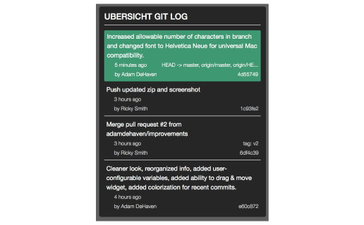

# Übersicht Git Log Widget

> Made for [Übersicht](http://tracesof.net/uebersicht/)

Übersicht widget to display recent commits to your selected git repository. Widget allows you to select the branch of your project to display the log from (e.g. in case your team normally commit to a 'dev' branch before master).

## FEATURES
* Configure any git repository on your local machine and specify the branch to display.
* Displays project name and commit history including: commit message, relative timestamp, branch info, author info, and hash
* Widget is positioned initially on screen (configurable), and then can be moved to desired position by pressing Übersicht interaction key and then clicking and dragging widget.
* Color indicators for recent commits.

## SETUP
1. Set your repository's local folder on line 8.
2. Set the number of commits to show on line 11.
3. Set the refresh frequency on line 14.
4. Configure the Project Variables starting on line 19:

Variable|Description|Example/Default
:---:|:---|:---:
`branch`|The git branch of the project to show the log from|`master`
`title`|Project's title to display at the top of the widget|`Project Name`
`id`|CSS id to use to wrap the widget element|`project-name`
`width`|Width of widget, in pixels|`300px`
-----|Initial screen position variables|-----
`position`|Position the widget from top or bottom edge of screen|`top` or `bottom`
`align`|Position the widget from left or right edge of screen|`left` or `right`
`initial_x`|Pixels horizontal away from the screen `align` variable|`10px`
`initial_y`|Pixels vertical away from the screen `position` variable|`10px`

## Credit
* Originally created by [@DigitallyBorn](https://github.com/DigitallyBorn)
* Improvements by [@adamdehaven](https://github.com/adamdehaven)
* Maintained by both
